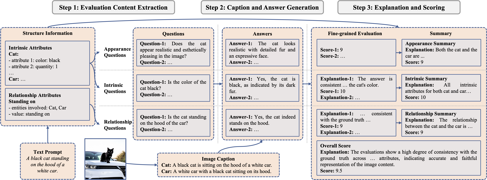

<div align="center">

# T2I-Eval: Open-source toolkit for automatic evaluation of text-to-image generation task

</div>

<h5 align=center>

[](https://arxiv.org/abs/2411.15488)
[](https://huggingface.co/collections/DataHammer/t2i-eval-673edfd8e09bf82c04e2fbf1)
[](https://github.com/maziao/T2I-Eval/blob/main/LICENSE)
[](https://github.com/maziao/T2I-Eval/stargazers)

</h5>

Implementation of paper **[Automatic Evaluation for Text-to-image Generation: Task-decomposed
Framework, Distilled Training, and Meta-evaluation Benchmark](https://arxiv.org/abs/2411.15488)**.



## 🔥 News

- 2024 Nov 28: Code for evaluation and fine-tuning is released. Code for training set construction is coming soon.
- 2024 Nov 25: Paper available on [Arxiv](https://arxiv.org/abs/2411.15488). Code coming Soon.

## Resources

| Item              | Repository                                                                                                 |
| ----------------- | ---------------------------------------------------------------------------------------------------------- |
| Distilled Model   | [🤗DataHammer/T2I_Eval-MiniCPM-V-2_6](https://huggingface.co/DataHammer/T2I_Eval-MiniCPM-V-2_6)            |
| Benchmark Dataset | [🤗DataHammer/T2I-Eval-Bench](https://huggingface.co/datasets/DataHammer/T2I-Eval-Bench)                   |
| Training Dataset  | [🤗DataHammer/T2I-Eval-Distill-GPT-4o](https://huggingface.co/datasets/DataHammer/T2I-Eval-Distill-GPT-4o) |

## Performance

| Methods                                      | Manual-1 ($\rho$) | Manual-1 ($\tau$) | Manual-2 ($\rho$) | Manual-2 ($\tau$) | Manual-3 ($\rho$) | Manual-3 ($\tau$) | Manual-Avg. ($\rho$) | Manual-Avg. ($\tau$) |
| -------------------------------------------- | ----------------- | ----------------- | ----------------- | ----------------- | ----------------- | ----------------- | -------------------- | -------------------- |
| **Average Score of Human Annotators**        |
| $\text{Manual-Avg.}$                         | 0.9511            | 0.8807            | 0.9452            | 0.8686            | 0.9513            | 0.8793            | -                    | -                    |
| **Traditional Methods**                      |
| $\text{FID}$                                 | -0.1183           | -0.0871           | -0.1000           | -0.0724           | -0.0897           | -0.0685           | -0.1231              | -0.0862              |
| $\text{LPIPS}$                               | -0.1206           | -0.0898           | -0.0882           | -0.0644           | -0.1025           | -0.0732           | -0.1244              | -0.0856              |
| $\text{DreamSim}$                            | -0.1284           | -0.0953           | -0.1230           | -0.0897           | -0.1308           | -0.0973           | -0.1382              | -0.0968              |
| $\text{CLIPScore}$                           | 0.1532            | 0.1078            | 0.1725            | 0.1210            | 0.1227            | 0.0855            | 0.1505               | 0.1016               |
| $\text{BLIPv2Score}$                         | 0.2278            | 0.1588            | 0.2280            | 0.1617            | 0.2134            | 0.1477            | 0.2152               | 0.1423               |
| $\text{ImageReward}$                         | 0.4171            | 0.3065            | 0.3712            | 0.2690            | 0.4134            | 0.3030            | 0.4046               | 0.2839               |
| **LLM/MLLM-Based Methods**                   |
| $\text{LLMScore}_\text{GPT-4}$               | 0.3009            | 0.2212            | 0.2697            | 0.2012            | 0.3299            | 0.2497            | 0.3096               | 0.2228               |
| $\text{DSG}_\text{Dependent}$                | 0.4742            | 0.3790            | 0.4204            | 0.3339            | 0.4562            | 0.3652            | 0.4582               | 0.3512               |
| $\text{DSG}_\text{Independent}$              | 0.4815            | 0.3891            | 0.4382            | 0.3502            | 0.4721            | 0.3827            | 0.4704               | 0.3655               |
| $\text{VQAScore}_\text{CLIP-FlanT5}$         | 0.4984            | 0.3768            | 0.4864            | 0.3619            | 0.5118            | 0.3854            | 0.5116               | 0.3712               |
| $\text{VIEScore}_\text{MiniCPM-V-2.6}$       | 0.2834            | 0.2251            | 0.2814            | 0.2231            | 0.3016            | 0.2422            | 0.2941               | 0.2250               |
| $\text{VIEScore}_{\text{MiniCPM-V-2.6}^{*}}$ | 0.4906            | 0.3878            | 0.4869            | 0.3836            | 0.4889            | 0.3899            | 0.5101               | 0.3897               |
| $\text{VIEScore}_\text{GPT-4o}$              | **0.5522**        | **0.4283**        | 0.5306            | 0.4101            | 0.5170            | 0.4024            | 0.5545               | 0.4170               |
| **Closed-Source MLLM with Our Pipeline**     |
| $\text{Ours}_\text{GPT-4o}$                  | 0.5437            | 0.4302            | 0.5355            | 0.4214            | 0.5138            | 0.4061            | 0.5566               | 0.4285               |
| **Our Fine-tuned Open-source MLLM**          |
| $\text{Ours}_\text{MiniCPM-V-2.6}$           | 0.5334            | 0.4192            | **0.5946**        | **0.4644**        | **0.5537**        | **0.4348**        | **0.5802**           | **0.4409**           |

## 🚀 Getting Started

### 🛠️ Installation

```shell
conda create -n t2i_eval python=3.10 -y
conda activate t2i_eval
git clone https://github.com/maziao/T2I-Eval.git
cd T2I-Eval
pip install -r requirements.txt
```

Install vLLM for faster inference with [this guide](https://docs.vllm.ai/en/latest/getting_started/installation.html):

```shell
pip install vllm
```

**[Optional]** If you want to fine-tune your own evaluation MLLM, please setup SWIFT following [this instruction](https://swift.readthedocs.io/en/latest/GetStarted/Installation.html):

```shell
pip install 'ms-swift[all]' -U
```

### Model and Data Preparation

- **[Optional]** Enable hf_transfer for faster downloads

  ```shell
  pip install hf_transfer
  export HF_HUB_ENABLE_HF_TRANSFER=1
  ```

- Download MiniCPM-V-2.6 checkpoint (**NOTE**: You need to agree to share your contact information to [access this model](https://huggingface.co/openbmb/MiniCPM-V-2_6))

  ```shell
  # if MiniCPM-V-2.6 checkpoint has not been downloaded
  mkdir -p models/minicpm-v-2_6/original
  huggingface-cli download openbmb/MiniCPM-V-2_6 \
    --local-dir models/minicpm-v-2_6/original \
    --local-dir-use-symlink False

  # if MiniCPM-V-2.6 checkpoint has already been downloaded
  mkdir -p models/minicpm-v-2_6
  ln -s PATH_TO_CHECKPOINT models/minicpm-v-2_6/original
  ```

- Download LoRA adapter for MiniCPM-V-2.6

  ```shell
  mkdir -p models/minicpm-v-2_6/LoRA
  huggingface-cli download DataHammer/T2I_Eval-MiniCPM-V-2_6 \
    --local-dir models/minicpm-v-2_6/LoRA \
    --local-dir-use-symlink False

  # merge LoRA adapter with the original checkpoint
  bash scripts/merge_adapter.sh GPU_ID # replace GPU_ID
  ```

- Download benchmark dataset

  ```shell
  mkdir -p data/test
  huggingface-cli download DataHammer/T2I-Eval-Bench \
    --repo-type dataset \
    --local-dir data/test \
    --local-dir-use-symlink False

  tar -zxvf data/test/images.tar.gz --directory=data/test
  ```

- **[Optional]** Download training dataset

  ```shell
  # download the training dataset for fine-tuning (optional)
  mkdir -p data/train
  huggingface-cli download DataHammer/T2I-Eval-Distill-GPT-4o \
    --repo-type dataset \
    --local-dir data/train \
    --local-dir-use-symlink False

  tar -zxvf data/train/t2i-eval-distill-gpt-4o.json.tar.gz --directory=data/train
  tar -zxvf data/train/images/COCO.tar.gz --directory=data/train/images
  tar -zxvf data/train/images/LLM.tar.gz --directory=data/train/images
  tar -zxvf data/train/images/reference.tar.gz --directory=data/train/images
  ```

### Evaluation

- Deploying with vLLM (Recommended)

  ```shell
  bash scripts/deploy.sh GPU_ID HOST_ADDR PORT # 0 localhost 65535
  ```

- Inference

  ```shell
  bash scripts/inference.sh HOST_ADDR PORT # localhost 65535
  ```

### Fine-tuning

#### [Optional] Customize Sample Format for Your Model

For example, when using MiniCPM-V-2.6, you need to create a [new class](./src/dataset/minicpm_v.py) that inherits from the base dataset constructor class, $\verb|T2VEvalSFTDataConstructor|$. In this class, you are required to implement two key methods:

- $\verb|replace_image_placeholder|$: replace the original image placeholders with the one of the model you are about to fine-tune.
- $\verb|conv_template|$: construct a single training sample (a conversation) given the corpus. The given corpus follows this format:

  ```json
  {
    "gt_image": str,
    "query": str,
    "response": str,
    "history": [
      (query_1, response_1),
      ...
    ],
    "ref_image": str | None,
    "id": str | None
  }
  ```

#### Construct Training Dataset

- Convert training data into the target format

  ```shell
  mkdir -p data/train/minicpm-v-2_6/raw

  python build_dataset.py \
    --data-files data/train/t2i-eval-distill-gpt-4o.json \
    --output-dir data/train/minicpm-v-2_6/raw
  ```

- Make an index file `data/train/minicpm-v-2_6/index.txt` for sub-tasks:

  ```txt
  extract.json 8
  appearance-multi-stage_1.json 1
  appearance-multi-stage_2.json 1
  intrinsic-multi-stage_1.json 2
  intrinsic-multi-stage_2.json 2
  relationship-multi-stage_1.json 3
  relationship-multi-stage_2.json 3
  summarize-multi-stage_1.json 2
  summarize-multi-stage_2.json 2
  ```

- Merge training samples of all sub-tasks

  ```shell
  python merge_dataset.py \
    --data-dir data/train/minicpm-v-2_6/raw/t2i-eval-distill-gpt-4o \
    --index-file data/train/minicpm-v-2_6/index.txt \
    --output-file data/train/minicpm-v-2_6/train.json \
    --rebalance
  ```

#### Start Training (with SWIFT)

```shell
# data parallel on 4 Nvidia A100-SXM4-80GB
bash scripts/finetune_lora.sh 0,1,2,3 4
```

## 📎 Citation

If you find this repository useful for your research, please cite our paper:

```bibtex
@misc{tu2024automaticevaluationtexttoimagegeneration,
    title={Automatic Evaluation for Text-to-image Generation: Task-decomposed Framework, Distilled Training, and Meta-evaluation Benchmark},
    author={Rong-Cheng Tu and Zi-Ao Ma and Tian Lan and Yuehao Zhao and Heyan Huang and Xian-Ling Mao},
    year={2024},
    eprint={2411.15488},
    archivePrefix={arXiv},
    primaryClass={cs.CL},
    url={https://arxiv.org/abs/2411.15488},
}
```
